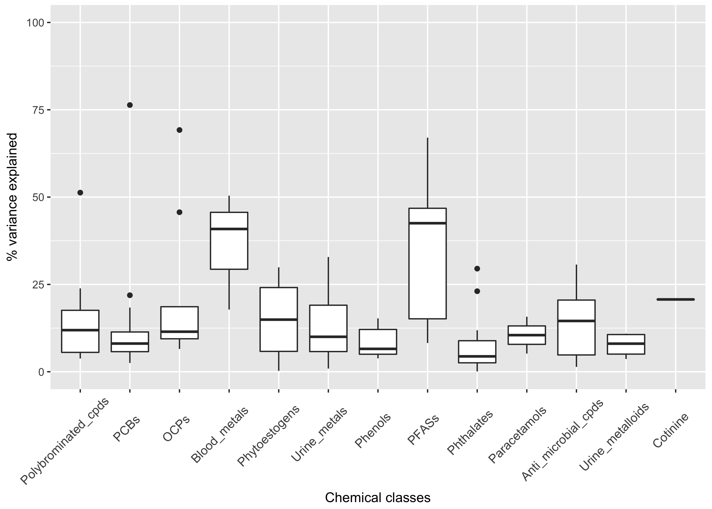
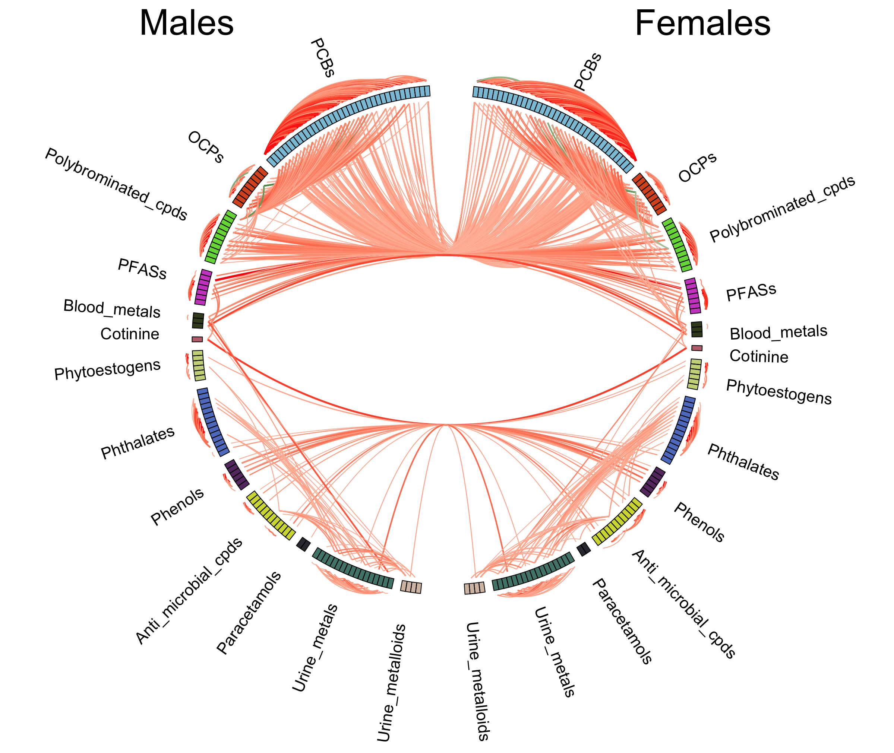
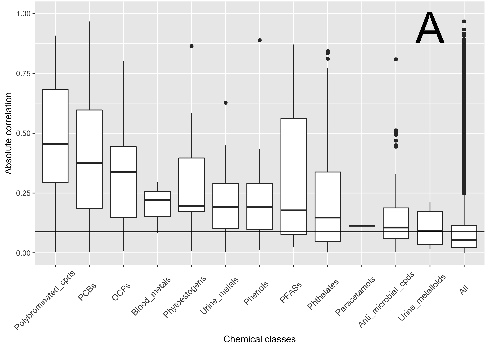
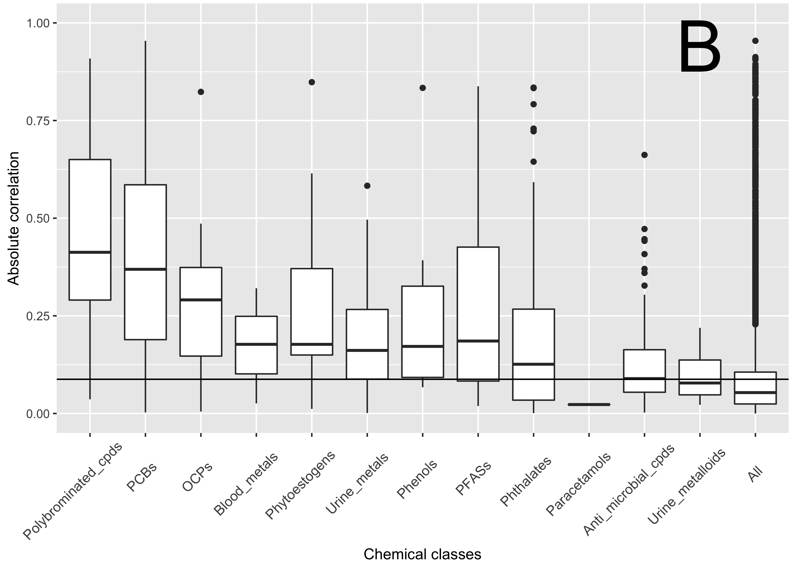
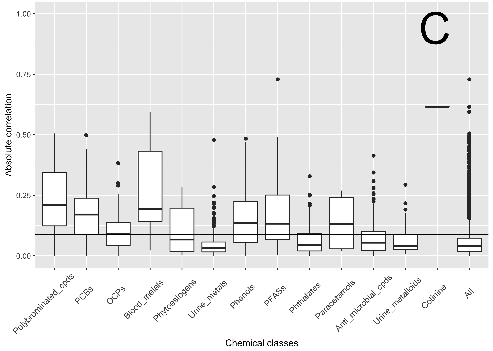

# Toward Capturing the Exposome: Exposure Biomarker Variability and Co-Exposure Patterns in the Shared Environment

*Submitted for peer review, Fall 2017*

## Authors
- Ming Kei (Jake) Chung
  - github: [\@jakemkc](http://github.com/jakemkc)
  - twitter: [\@jakekei](http://twitter.com/jakekei)
  - email: jake_chung[at]hms[dot]harvard[dot]edu
- Kurunthachalam Kannan
  - email: kurunthachalam[dot]kannan[at]health[dot]ny[dot]gov
- Germaine M. Buck Louis
  - email: louisg[at]mail[dot]nih[dot]gov
- Chirag J. Patel
  - github: [\@chiragjp](http://github.com/chiragjp)
  - web: [www.chiragjpgroup.org](www.chiragjpgroup.org)
  
## Figure 1
 

Figure 1. Analytical scheme to investigate the variability and correlations in this study. A) We first extract the residuals from a linear model after adjusting for the base covariates (total lipids or creatinine) to calculate the effective number of variables (Meff) and Spearman’s rank correlation (rs). B) Then, we used another linear model with an additional age variable to obtain residuals and conducted paired t-test to test the difference of biomarkers between females and males living in the same household. C) Afterward, we further adjusted for sex prior to extracting residuals to calculate the percentage of biomarker variance explained by the shared environment.

## Figure 2
 

Figure 2. Summary of the percentage variance explained by the shared environment. Boxplots of the adjusted coefficient of determination (R2) within different chemical classes are shown. Interquartile range is not shown for Cotinine class because it contains only 1 compound. For each box, median and interquartile range are drawn and the whiskers are extended to the largest values within 1.5*interquartile range. Black dots denote correlations outside of the range covered by the whiskers.

## Figure 3
 

Figure 3. Exposome correlation globe showing the relationships between females, males and couples. Right-half represents biomarkers in females; left-half represents biomarkers in males. Only Spearman’s rank correlations greater than 0.25 and smaller than −0.25 were shown as connections in the globe. Red line denotes positive correlation and dark green line denotes negative one. Color intensity and line width are proportional to the size of the correlation. Within-class and between-class correlations are shown outside and inside of the track respectively. Correlations in couples are indicated by the lines linking females and males (i.e. crossing the vertical-half of the globe).

 
## Figure 4
 
 
 
 
 

Figure 4. Boxplots of Spearman’s rank correlations (rs) within different chemical classes. A) Females; B) Males; and C) Couples. For couples, summary statistics were estimated with the full 128 x 128 correlation matrix instead of with the half triangle. Certain classes contain only 1 pair of correlation (paracetamols in females, paracetamols in males, and cotinine in couples). “All” represents the grouping by the correlation of all pairs of chemicals available. Horizontal line drawn across the chemical classes is equal to the 95th percentile of the null distribution obtained from permuting the concentrations of all chemicals. Definition of whisker and black dot can be referred to the caption in Figure 2.

## S Figure 1

 
 
 
 
 

Figure S1. Correlation heat maps showing the Spearman’s rank correlations (rs) across 128 chemicals grouped in 13 different classes. A) Females; B) Males; and C) Couples. Of each heat map, color key on the top left denotes color intensity of correlation values and is superimposed with an outline of a histogram. The corresponding colors of chemical classes are shown on the left. Observed larger “cluster” across groups are annotated with hollow red squares. 

 
 
 
